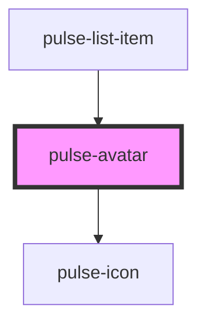

# pulse-avatar

<!-- Auto Generated Below -->

## Properties

| Property           | Attribute          | Description | Type                                                                                                                                                           | Default         |
| ------------------ | ------------------ | ----------- | -------------------------------------------------------------------------------------------------------------------------------------------------------------- | --------------- |
| `avatartype`       | `avatartype`       |             | `"icon" \| "img" \| "logo" \| "text"`                                                                                                                          | `'text'`        |
| `borderdashed`     | `borderdashed`     |             | `boolean`                                                                                                                                                      | `false`         |
| `color`            | `color`            |             | `"bouquet" \| "carbon" \| "carbon-light" \| "copper" \| "error" \| "gold" \| "info" \| "olive" \| "primary" \| "scooter" \| "success" \| "warning" \| "white"` | `'white'`       |
| `colorvariant`     | `colorvariant`     |             | `"100" \| "400" \| "700" \| "900"`                                                                                                                             | `'400'`         |
| `icon`             | `icon`             |             | `string`                                                                                                                                                       | `undefined`     |
| `iconcolor`        | `iconcolor`        |             | `"bouquet" \| "carbon" \| "carbon-light" \| "copper" \| "error" \| "gold" \| "info" \| "olive" \| "primary" \| "scooter" \| "success" \| "warning" \| "white"` | `'carbon'`      |
| `iconcolorvariant` | `iconcolorvariant` |             | `"100" \| "400" \| "700" \| "900"`                                                                                                                             | `'700'`         |
| `logo`             | `logo`             |             | `"bbog" \| "claro" \| "facilpass" \| "master" \| "movistar" \| "tigo" \| "virgin" \| "visa"`                                                                   | `'bbog'`        |
| `name`             | `name`             |             | `string`                                                                                                                                                       | `this.avatarId` |
| `size`             | `size`             |             | `"l" \| "m" \| "s" \| "xl" \| "xs"`                                                                                                                            | `'m'`           |
| `text`             | `text`             |             | `string`                                                                                                                                                       | `'AA'`          |
| `url`              | `url`              |             | `string`                                                                                                                                                       | `undefined`     |

## Dependencies

### Used by

 - [pulse-list-item](../../pulse-mol/pulse-list-item)

### Depends on

- [pulse-icon](../icon)

### Graph

----------------------------------------------

*Team pulse.io! ⭕*
