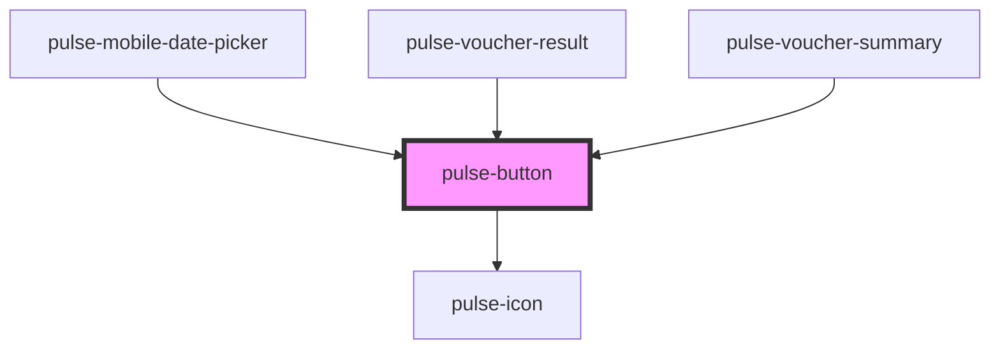

# pulse-button

<!-- Auto Generated Below -->

## Properties

| Property           | Attribute            | Description | Type                                                                                                                                                           | Default     |
| ------------------ | -------------------- | ----------- | -------------------------------------------------------------------------------------------------------------------------------------------------------------- | ----------- |
| `block`            | `block`              |             | `boolean`                                                                                                                                                      | `false`     |
| `color`            | `color`              |             | `"bouquet" \| "carbon" \| "carbon-light" \| "copper" \| "error" \| "gold" \| "info" \| "olive" \| "primary" \| "scooter" \| "success" \| "warning" \| "white"` | `'primary'` |
| `colorgradient`    | `colorgradient`      |             | `boolean`                                                                                                                                                      | `true`      |
| `colorvariant`     | `colorvariant`       |             | `"100" \| "400" \| "700" \| "900"`                                                                                                                             | `'700'`     |
| `disabled`         | `disabled`           |             | `boolean`                                                                                                                                                      | `false`     |
| `fill`             | `fill`               |             | `"clear" \| "outline" \| "solid"`                                                                                                                              | `'solid'`   |
| `icon`             | `icon`               |             | `string`                                                                                                                                                       | `undefined` |
| `iconColor`        | `icon-color`         |             | `"bouquet" \| "carbon" \| "carbon-light" \| "copper" \| "error" \| "gold" \| "info" \| "olive" \| "primary" \| "scooter" \| "success" \| "warning" \| "white"` | `'primary'` |
| `iconColorVariant` | `icon-color-variant` |             | `"100" \| "400" \| "700" \| "900"`                                                                                                                             | `'700'`     |
| `iconPosition`     | `icon-position`      |             | `"left" \| "right"`                                                                                                                                            | `'right'`   |
| `pulseButtonSize`  | `pulse-button-size`  |             | `"default" \| "small"`                                                                                                                                         | `'default'` |
| `pulseButtonType`  | `pulse-button-type`  |             | `"primary" \| "secondary" \| "tertiary"`                                                                                                                       | `'primary'` |
| `type`             | `type`               |             | `"button" \| "reset" \| "submit"`                                                                                                                              | `'button'`  |

## Events

| Event        | Description | Type               |
| ------------ | ----------- | ------------------ |
| `pulseBlur`  |             | `CustomEvent<any>` |
| `pulseFocus` |             | `CustomEvent<any>` |

## Dependencies

### Used by

 - [pulse-mobile-date-picker](../../pulse-mol/mobile-date-picker)
 - [pulse-voucher-result](../../pulse-patterns/voucher-result)
 - [pulse-voucher-summary](../../pulse-patterns/voucher-summary)

### Depends on

- [pulse-icon](../icon)

### Graph

----------------------------------------------

*Team pulse.io! ⭕*
