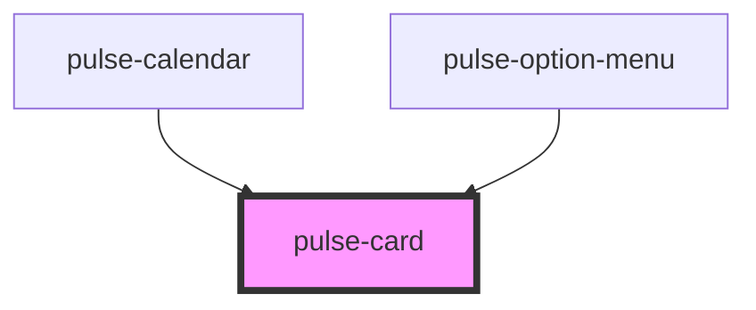

# pulse-card

<!-- Auto Generated Below -->

## Properties

| Property         | Attribute        | Description | Type                                                                                                                                                           | Default     |
| ---------------- | ---------------- | ----------- | -------------------------------------------------------------------------------------------------------------------------------------------------------------- | ----------- |
| `color`          | `color`          |             | `"bouquet" \| "carbon" \| "carbon-light" \| "copper" \| "error" \| "gold" \| "info" \| "olive" \| "primary" \| "scooter" \| "success" \| "warning" \| "white"` | `undefined` |
| `colorgradient`  | `colorgradient`  |             | `boolean`                                                                                                                                                      | `false`     |
| `colorvariant`   | `colorvariant`   |             | `"100" \| "400" \| "700" \| "900"`                                                                                                                             | `'700'`     |
| `elevation`      | `elevation`      |             | `0 \| 16 \| 2 \| 24 \| 4 \| 8`                                                                                                                                 | `8`         |
| `elevationhover` | `elevationhover` |             | `0 \| 16 \| 2 \| 24 \| 4 \| 8`                                                                                                                                 | `0`         |

## Methods

### `recalculate() => Promise<void>`

#### Returns

Type: `Promise<void>`

## Dependencies

### Used by

 - [pulse-calendar](../../pulse-mol/calendar)
 - [pulse-option-menu](../option-menu)

### Graph

----------------------------------------------

*Team pulse.io! ⭕*
