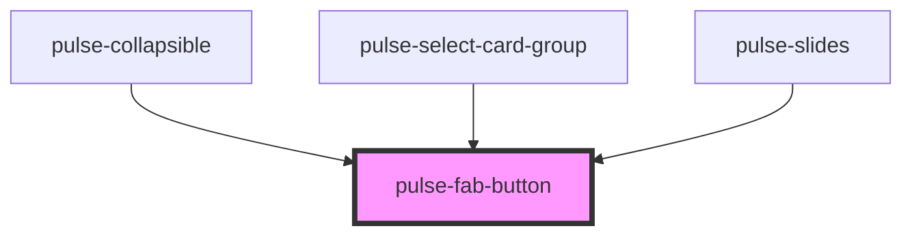

# pulse-fab-button

<!-- Auto Generated Below -->

## Properties

| Property        | Attribute       | Description | Type                                                                                                                                                           | Default     |
| --------------- | --------------- | ----------- | -------------------------------------------------------------------------------------------------------------------------------------------------------------- | ----------- |
| `color`         | `color`         |             | `"bouquet" \| "carbon" \| "carbon-light" \| "copper" \| "error" \| "gold" \| "info" \| "olive" \| "primary" \| "scooter" \| "success" \| "warning" \| "white"` | `undefined` |
| `colorgradient` | `colorgradient` |             | `boolean`                                                                                                                                                      | `false`     |
| `colorvariant`  | `colorvariant`  |             | `"100" \| "400" \| "700" \| "900"`                                                                                                                             | `'700'`     |
| `disabled`      | `disabled`      |             | `boolean`                                                                                                                                                      | `false`     |
| `text`          | `text`          |             | `string`                                                                                                                                                       | `undefined` |
| `textposition`  | `textposition`  |             | `"bottom" \| "right"`                                                                                                                                          | `'bottom'`  |
| `type`          | `type`          |             | `"button" \| "reset" \| "submit"`                                                                                                                              | `'button'`  |

## Events

| Event              | Description | Type               |
| ------------------ | ----------- | ------------------ |
| `fabButtonDidLoad` |             | `CustomEvent<any>` |
| `pulseBlur`        |             | `CustomEvent<any>` |
| `pulseFocus`       |             | `CustomEvent<any>` |

## Dependencies

### Used by

 - [pulse-collapsible](../../pulse-mol/collapsible)
 - [pulse-select-card-group](../../pulse-mol/select-card-group)
 - [pulse-slides](../../pulse-mol/slides)

### Graph

----------------------------------------------

*Team pulse.io! ⭕*
