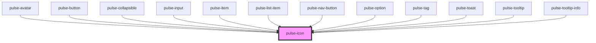

# pulse-icon

<!-- Auto Generated Below -->

## Properties

| Property       | Attribute      | Description | Type                                                                                                                                                           | Default       |
| -------------- | -------------- | ----------- | -------------------------------------------------------------------------------------------------------------------------------------------------------------- | ------------- |
| `color`        | `color`        |             | `"bouquet" \| "carbon" \| "carbon-light" \| "copper" \| "error" \| "gold" \| "info" \| "olive" \| "primary" \| "scooter" \| "success" \| "warning" \| "white"` | `'primary'`   |
| `colorvariant` | `colorvariant` |             | `"100" \| "400" \| "700" \| "900"`                                                                                                                             | `'700'`       |
| `icon`         | `icon`         |             | `string`                                                                                                                                                       | `undefined`   |
| `name`         | `name`         |             | `string`                                                                                                                                                       | `this.iconId` |
| `size`         | `size`         |             | `"l" \| "m" \| "s" \| "xl" \| "xs"`                                                                                                                            | `'m'`         |

## Methods

### `getIconsNames() => Promise<string[]>`

#### Returns

Type: `Promise<string[]>`

## Dependencies

### Used by

 - [pulse-avatar](../avatar)
 - [pulse-button](../button)
 - [pulse-collapsible](../../pulse-mol/collapsible)
 - [pulse-input](../input)
 - [pulse-item](../../pulse-mol/item)
 - [pulse-list-item](../../pulse-mol/pulse-list-item)
 - [pulse-nav-button](../nav-button)
 - [pulse-option](../option)
 - [pulse-tag](../tag)
 - [pulse-toast](../../pulse-mol/toast)
 - [pulse-tooltip](../tooltip)
 - [pulse-tooltip-info](../tooltip-info)

### Graph

----------------------------------------------

*Team pulse.io! ⭕*
