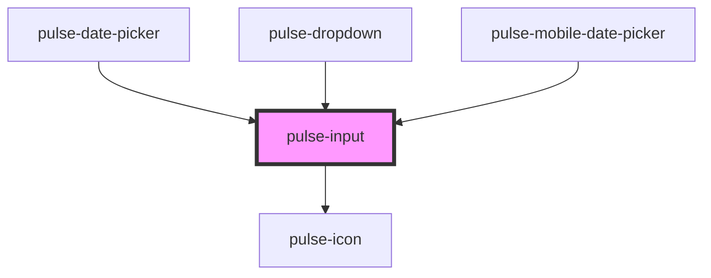

# pulse-input

<!-- Auto Generated Below -->

## Properties

| Property           | Attribute          | Description | Type                                                                                                                                                           | Default        |
| ------------------ | ------------------ | ----------- | -------------------------------------------------------------------------------------------------------------------------------------------------------------- | -------------- |
| `actionableicon`   | `actionableicon`   |             | `boolean`                                                                                                                                                      | `false`        |
| `autocomplete`     | `autocomplete`     |             | `"off" \| "on"`                                                                                                                                                | `'off'`        |
| `autofocus`        | `autofocus`        |             | `boolean`                                                                                                                                                      | `false`        |
| `blocked`          | `blocked`          |             | `boolean`                                                                                                                                                      | `false`        |
| `disabled`         | `disabled`         |             | `boolean`                                                                                                                                                      | `false`        |
| `hasdecimals`      | `hasdecimals`      |             | `boolean`                                                                                                                                                      | `false`        |
| `icon`             | `icon`             |             | `string`                                                                                                                                                       | `undefined`    |
| `iconcolor`        | `iconcolor`        |             | `"bouquet" \| "carbon" \| "carbon-light" \| "copper" \| "error" \| "gold" \| "info" \| "olive" \| "primary" \| "scooter" \| "success" \| "warning" \| "white"` | `'carbon'`     |
| `iconcolorvariant` | `iconcolorvariant` |             | `"100" \| "400" \| "700" \| "900"`                                                                                                                             | `'400'`        |
| `inputmode`        | `inputmode`        |             | `string`                                                                                                                                                       | `undefined`    |
| `inputtextalign`   | `inputtextalign`   |             | `"center" \| "inherit" \| "initial" \| "justify" \| "left" \| "right"`                                                                                         | `'left'`       |
| `label`            | `label`            |             | `string`                                                                                                                                                       | `undefined`    |
| `labelerror`       | `labelerror`       |             | `string`                                                                                                                                                       | `''`           |
| `lefticon`         | `lefticon`         |             | `boolean`                                                                                                                                                      | `false`        |
| `max`              | `max`              |             | `string`                                                                                                                                                       | `undefined`    |
| `maxlength`        | `maxlength`        |             | `number`                                                                                                                                                       | `undefined`    |
| `min`              | `min`              |             | `string`                                                                                                                                                       | `undefined`    |
| `minlength`        | `minlength`        |             | `number`                                                                                                                                                       | `undefined`    |
| `name`             | `name`             |             | `string`                                                                                                                                                       | `this.inputId` |
| `optional`         | `optional`         |             | `boolean`                                                                                                                                                      | `false`        |
| `pattern`          | `pattern`          |             | `string`                                                                                                                                                       | `undefined`    |
| `placeholder`      | `placeholder`      |             | `string`                                                                                                                                                       | `undefined`    |
| `readonly`         | `readonly`         |             | `boolean`                                                                                                                                                      | `false`        |
| `required`         | `required`         |             | `boolean`                                                                                                                                                      | `false`        |
| `spellcheck`       | `spellcheck`       |             | `boolean`                                                                                                                                                      | `false`        |
| `state`            | `state`            |             | `"basic" \| "error" \| "success" \| "warn"`                                                                                                                    | `'basic'`      |
| `step`             | `step`             |             | `string`                                                                                                                                                       | `undefined`    |
| `type`             | `type`             |             | `"currency" \| "date" \| "email" \| "number" \| "password" \| "search" \| "tel" \| "text" \| "time" \| "url"`                                                  | `'text'`       |
| `value`            | `value`            |             | `string`                                                                                                                                                       | `''`           |

## Events

| Event               | Description | Type                         |
| ------------------- | ----------- | ---------------------------- |
| `iconClick`         |             | `CustomEvent<any>`           |
| `inputBlur`         |             | `CustomEvent<void>`          |
| `inputClick`        |             | `CustomEvent<any>`           |
| `inputFocus`        |             | `CustomEvent<any>`           |
| `inputKeyDown`      |             | `CustomEvent<any>`           |
| `inputKeyUp`        |             | `CustomEvent<any>`           |
| `ionInputDidUnload` |             | `CustomEvent<void>`          |
| `keyBoardInput`     |             | `CustomEvent<KeyboardEvent>` |
| `pulseInputDidLoad` |             | `CustomEvent<void>`          |
| `valueEmmitInput`   |             | `CustomEvent<string>`        |

## Dependencies

### Used by

 - [pulse-date-picker](../../pulse-mol/date-picker)
 - [pulse-dropdown](../../pulse-mol/dropdown)
 - [pulse-mobile-date-picker](../../pulse-mol/mobile-date-picker)

### Depends on

- [pulse-icon](../icon)

### Graph

----------------------------------------------

*Team pulse.io! ⭕*
