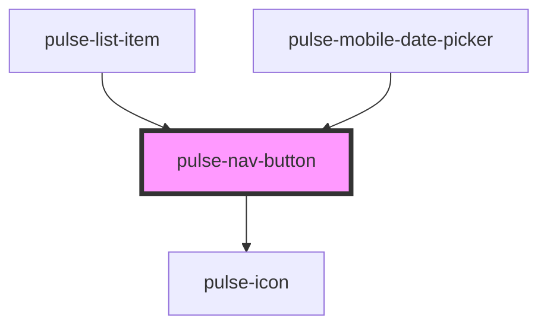

# pulse-nav-button

<!-- Auto Generated Below -->

## Properties

| Property         | Attribute          | Description | Type                                                                                                                                                           | Default     |
| ---------------- | ------------------ | ----------- | -------------------------------------------------------------------------------------------------------------------------------------------------------------- | ----------- |
| `disabled`       | `disabled`         |             | `boolean`                                                                                                                                                      | `false`     |
| `fill`           | `fill`             |             | `"clear" \| "solid"`                                                                                                                                           | `'solid'`   |
| `icon`           | `icon`             |             | `string`                                                                                                                                                       | `undefined` |
| `iconPosition`   | `icon-position`    |             | `"left" \| "right"`                                                                                                                                            | `'left'`    |
| `iconcolor`      | `iconcolor`        |             | `"bouquet" \| "carbon" \| "carbon-light" \| "copper" \| "error" \| "gold" \| "info" \| "olive" \| "primary" \| "scooter" \| "success" \| "warning" \| "white"` | `'primary'` |
| `onlyIconDevice` | `only-icon-device` |             | `GridBreakpoints[] \| string`                                                                                                                                  | `undefined` |

## Events

| Event        | Description | Type               |
| ------------ | ----------- | ------------------ |
| `pulseBlur`  |             | `CustomEvent<any>` |
| `pulseFocus` |             | `CustomEvent<any>` |

## Dependencies

### Used by

 - [pulse-list-item](../../pulse-mol/pulse-list-item)
 - [pulse-mobile-date-picker](../../pulse-mol/mobile-date-picker)

### Depends on

- [pulse-icon](../icon)

### Graph

----------------------------------------------

*Team pulse.io! ⭕*
