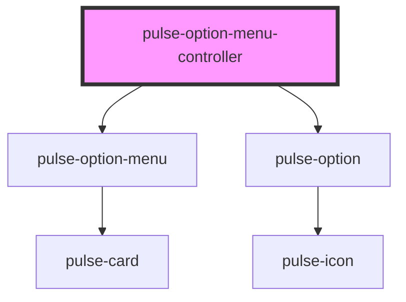

# pulse-option-menu-controller

<!-- Auto Generated Below -->

## Events

| Event         | Description | Type                  |
| ------------- | ----------- | --------------------- |
| `closeChange` |             | `CustomEvent<string>` |

## Methods

### `dismiss<T>(id: any) => Promise<T>`

#### Returns

Type: `Promise<T>`

### `present<T>(properties: PulseMenuData) => Promise<T>`

#### Returns

Type: `Promise<T>`

## Dependencies

### Depends on

- [pulse-option-menu](../option-menu)
- [pulse-option](../option)

### Graph

----------------------------------------------

*Team pulse.io! ⭕*
