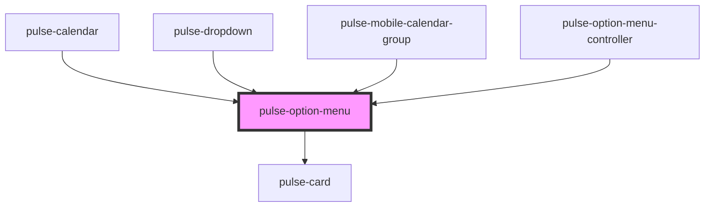

# pulse-option-menu

<!-- Auto Generated Below -->

## Properties

| Property         | Attribute     | Description | Type                                                                                                                                                                                             | Default       |
| ---------------- | ------------- | ----------- | ------------------------------------------------------------------------------------------------------------------------------------------------------------------------------------------------ | ------------- |
| `data`           | --            |             | `any[]`                                                                                                                                                                                          | `[]`          |
| `height`         | `height`      |             | `string`                                                                                                                                                                                         | `'auto'`      |
| `htmlelementref` | --            |             | `HTMLElement`                                                                                                                                                                                    | `undefined`   |
| `name`           | `name`        |             | `string`                                                                                                                                                                                         | `this.id`     |
| `orientation`    | `orientation` |             | `"bottom-end" \| "bottom-middle" \| "bottom-start" \| "left-end" \| "left-middle" \| "left-start" \| "right-end" \| "right-middle" \| "right-start" \| "top-end" \| "top-middle" \| "top-start"` | `'right-end'` |
| `show`           | `show`        |             | `boolean`                                                                                                                                                                                        | `true`        |
| `size`           | `size`        |             | `"l" \| "m" \| "s" \| "xl" \| "xs"`                                                                                                                                                              | `'xs'`        |
| `value`          | `value`       |             | `any`                                                                                                                                                                                            | `undefined`   |

## Events

| Event          | Description | Type                  |
| -------------- | ----------- | --------------------- |
| `presentEnd`   |             | `CustomEvent<string>` |
| `valueChanged` |             | `CustomEvent<any>`    |

## Methods

### `recalculate() => Promise<void>`

#### Returns

Type: `Promise<void>`

## Dependencies

### Used by

 - [pulse-calendar](../../pulse-mol/calendar)
 - [pulse-dropdown](../../pulse-mol/dropdown)
 - [pulse-mobile-calendar-group](../../pulse-mol/mobile-calendar-group)
 - [pulse-option-menu-controller](../option-menu-controller)

### Depends on

- [pulse-card](../card)

### Graph

----------------------------------------------

*Team pulse.io! ⭕*
