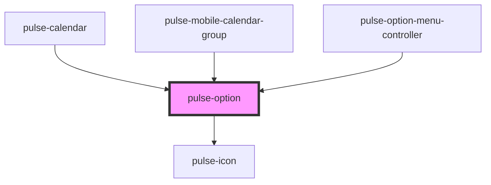

# pulse-option

<!-- Auto Generated Below -->

## Properties

| Property       | Attribute      | Description | Type                                                                                                                                                           | Default     |
| -------------- | -------------- | ----------- | -------------------------------------------------------------------------------------------------------------------------------------------------------------- | ----------- |
| `color`        | `color`        |             | `"bouquet" \| "carbon" \| "carbon-light" \| "copper" \| "error" \| "gold" \| "info" \| "olive" \| "primary" \| "scooter" \| "success" \| "warning" \| "white"` | `'carbon'`  |
| `colorvariant` | `colorvariant` |             | `"100" \| "400" \| "700" \| "900"`                                                                                                                             | `'700'`     |
| `disabled`     | `disabled`     |             | `boolean`                                                                                                                                                      | `false`     |
| `icon`         | `icon`         |             | `string`                                                                                                                                                       | `undefined` |
| `name`         | `name`         |             | `string`                                                                                                                                                       | `this.id`   |
| `showIcon`     | `show-icon`    |             | `boolean`                                                                                                                                                      | `false`     |
| `value`        | `value`        |             | `string`                                                                                                                                                       | `undefined` |

## Events

| Event           | Description | Type                  |
| --------------- | ----------- | --------------------- |
| `optionDidLoad` |             | `CustomEvent<void>`   |
| `optionOnClick` |             | `CustomEvent<string>` |

## Dependencies

### Used by

 - [pulse-calendar](../../pulse-mol/calendar)
 - [pulse-mobile-calendar-group](../../pulse-mol/mobile-calendar-group)
 - [pulse-option-menu-controller](../option-menu-controller)

### Depends on

- [pulse-icon](../icon)

### Graph

----------------------------------------------

*Team pulse.io! ⭕*
