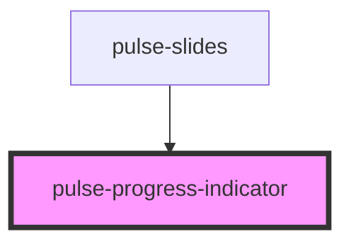

# pulse-progress-indicator

<!-- Auto Generated Below -->

## Properties

| Property       | Attribute      | Description | Type                                                                                                                                                           | Default     |
| -------------- | -------------- | ----------- | -------------------------------------------------------------------------------------------------------------------------------------------------------------- | ----------- |
| `color`        | `color`        |             | `"bouquet" \| "carbon" \| "carbon-light" \| "copper" \| "error" \| "gold" \| "info" \| "olive" \| "primary" \| "scooter" \| "success" \| "warning" \| "white"` | `'primary'` |
| `colorvariant` | `colorvariant` |             | `"100" \| "400" \| "700" \| "900"`                                                                                                                             | `'700'`     |
| `stepactive`   | `stepactive`   |             | `number`                                                                                                                                                       | `1`         |
| `steps`        | `steps`        |             | `number`                                                                                                                                                       | `1`         |

## Dependencies

### Used by

 - [pulse-slides](../../../pulse-mol/slides)

### Graph

----------------------------------------------

*Team pulse.io! ⭕*
