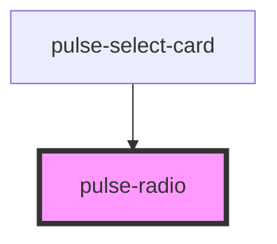

# pulse-radio

<!-- Auto Generated Below -->

## Properties

| Property        | Attribute       | Description | Type                                                                                                                                                           | Default        |
| --------------- | --------------- | ----------- | -------------------------------------------------------------------------------------------------------------------------------------------------------------- | -------------- |
| `checked`       | `checked`       |             | `boolean`                                                                                                                                                      | `false`        |
| `color`         | `color`         |             | `"bouquet" \| "carbon" \| "carbon-light" \| "copper" \| "error" \| "gold" \| "info" \| "olive" \| "primary" \| "scooter" \| "success" \| "warning" \| "white"` | `"success"`    |
| `colorgradient` | `colorgradient` |             | `boolean`                                                                                                                                                      | `false`        |
| `colorvariant`  | `colorvariant`  |             | `"100" \| "400" \| "700" \| "900"`                                                                                                                             | `'700'`        |
| `disabled`      | `disabled`      |             | `boolean`                                                                                                                                                      | `false`        |
| `label`         | `label`         |             | `string`                                                                                                                                                       | `undefined`    |
| `name`          | `name`          |             | `string`                                                                                                                                                       | `this.inputId` |
| `value`         | `value`         |             | `any`                                                                                                                                                          | `undefined`    |

## Events

| Event         | Description                                | Type                   |
| ------------- | ------------------------------------------ | ---------------------- |
| `radioSelect` | Emitted when the radio button is selected. | `CustomEvent<any>`     |
| `valueEmmit`  |                                            | `CustomEvent<boolean>` |

## Dependencies

### Used by

 - [pulse-select-card](../select-card)

### Graph

----------------------------------------------

*Team pulse.io! ⭕*
