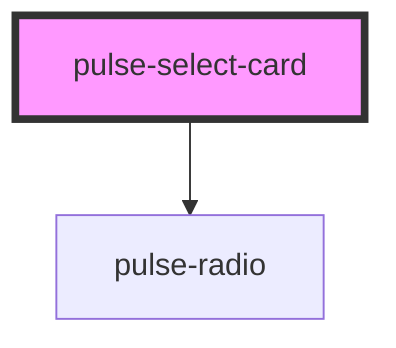

# pulse-select-card

<!-- Auto Generated Below -->

## Properties

| Property     | Attribute    | Description | Type                | Default     |
| ------------ | ------------ | ----------- | ------------------- | ----------- |
| `disabled`   | `disabled`   |             | `boolean`           | `false`     |
| `selected`   | `selected`   |             | `boolean`           | `false`     |
| `switchtype` | `switchtype` |             | `"none" \| "radio"` | `"none"`    |
| `value`      | `value`      |             | `any`               | `undefined` |

## Events

| Event         | Description                               | Type               |
| ------------- | ----------------------------------------- | ------------------ |
| `sCardSelect` | Emitted when the select card is selected. | `CustomEvent<any>` |

## Dependencies

### Depends on

- [pulse-radio](../radio)

### Graph

----------------------------------------------

*Team pulse.io! ⭕*
