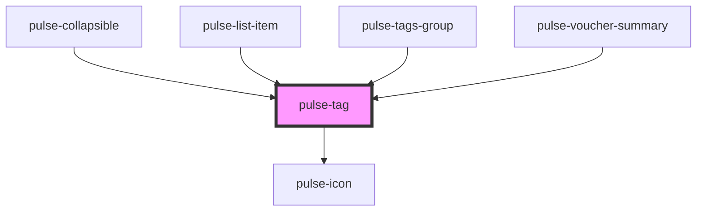

# pulse-tag

<!-- Auto Generated Below -->

## Properties

| Property       | Attribute      | Description | Type                                                                                                                                                           | Default     |
| -------------- | -------------- | ----------- | -------------------------------------------------------------------------------------------------------------------------------------------------------------- | ----------- |
| `closeable`    | `closeable`    |             | `boolean`                                                                                                                                                      | `false`     |
| `color`        | `color`        |             | `"bouquet" \| "carbon" \| "carbon-light" \| "copper" \| "error" \| "gold" \| "info" \| "olive" \| "primary" \| "scooter" \| "success" \| "warning" \| "white"` | `'primary'` |
| `colorvariant` | `colorvariant` |             | `"100" \| "400" \| "700" \| "900"`                                                                                                                             | `'900'`     |
| `disabled`     | `disabled`     |             | `boolean`                                                                                                                                                      | `false`     |
| `fill`         | `fill`         |             | `"clear" \| "outline" \| "solid"`                                                                                                                              | `'solid'`   |
| `maxwidth`     | `maxwidth`     |             | `number`                                                                                                                                                       | `0`         |
| `size`         | `size`         |             | `"l" \| "m" \| "s" \| "xl" \| "xs"`                                                                                                                            | `'s'`       |
| `skeleton`     | `skeleton`     |             | `boolean`                                                                                                                                                      | `false`     |
| `stayalways`   | `stayalways`   |             | `boolean`                                                                                                                                                      | `false`     |
| `text`         | `text`         |             | `string`                                                                                                                                                       | `undefined` |

## Events

| Event        | Description | Type               |
| ------------ | ----------- | ------------------ |
| `closeClick` |             | `CustomEvent<any>` |

## Dependencies

### Used by

 - [pulse-collapsible](../../pulse-mol/collapsible)
 - [pulse-list-item](../../pulse-mol/pulse-list-item)
 - [pulse-tags-group](../../pulse-mol/tags-group)
 - [pulse-voucher-summary](../../pulse-patterns/voucher-summary)

### Depends on

- [pulse-icon](../icon)

### Graph

----------------------------------------------

*Team pulse.io! ⭕*
