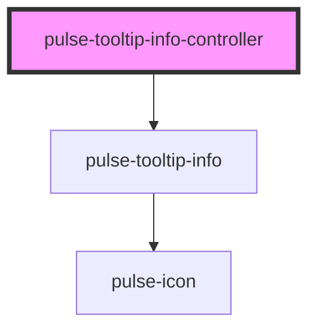

# pulse-tooltip-info-controller

<!-- Auto Generated Below -->

## Events

| Event           | Description | Type                  |
| --------------- | ----------- | --------------------- |
| `onCloseChange` |             | `CustomEvent<string>` |

## Methods

### `dismiss<T>(id: any) => Promise<T>`

#### Returns

Type: `Promise<T>`

### `present<T>(properties: any) => Promise<T>`

#### Returns

Type: `Promise<T>`

## Dependencies

### Depends on

- [pulse-tooltip-info](../tooltip-info)

### Graph

----------------------------------------------

*Team pulse.io! ⭕*
