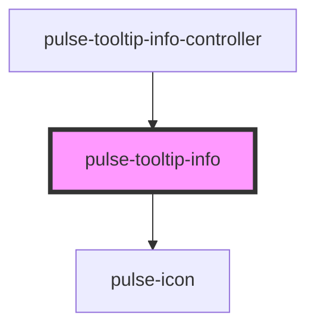

# pulse-tooltip-info

<!-- Auto Generated Below -->

## Properties

| Property          | Attribute         | Description | Type                                                                                                                                                                                             | Default       |
| ----------------- | ----------------- | ----------- | ------------------------------------------------------------------------------------------------------------------------------------------------------------------------------------------------ | ------------- |
| `color`           | `color`           |             | `"bouquet" \| "carbon" \| "carbon-light" \| "copper" \| "error" \| "gold" \| "info" \| "olive" \| "primary" \| "scooter" \| "success" \| "warning" \| "white"`                                   | `'carbon'`    |
| `colorvariant`    | `colorvariant`    |             | `"100" \| "400" \| "700" \| "900"`                                                                                                                                                               | `'900'`       |
| `content`         | --                |             | `PulseTooltipInfoData[]`                                                                                                                                                                         | `[]`          |
| `dynamicposition` | `dynamicposition` |             | `boolean`                                                                                                                                                                                        | `true`        |
| `htmlelementref`  | --                |             | `HTMLElement`                                                                                                                                                                                    | `undefined`   |
| `mobilebehavior`  | `mobilebehavior`  |             | `boolean`                                                                                                                                                                                        | `true`        |
| `orientation`     | `orientation`     |             | `"bottom-end" \| "bottom-middle" \| "bottom-start" \| "left-end" \| "left-middle" \| "left-start" \| "right-end" \| "right-middle" \| "right-start" \| "top-end" \| "top-middle" \| "top-start"` | `'right-end'` |
| `removeinclose`   | `removeinclose`   |             | `boolean`                                                                                                                                                                                        | `true`        |
| `size`            | `size`            |             | `"l" \| "m" \| "s" \| "xl" \| "xs"`                                                                                                                                                              | `'xs'`        |

## Events

| Event           | Description | Type                  |
| --------------- | ----------- | --------------------- |
| `onCloseChange` |             | `CustomEvent<string>` |
| `presentEnd`    |             | `CustomEvent<string>` |

## Methods

### `dismiss() => Promise<void>`

#### Returns

Type: `Promise<void>`

### `recalculate() => Promise<void>`

#### Returns

Type: `Promise<void>`

## Dependencies

### Used by

 - [pulse-tooltip-info-controller](../tooltip-info-controller)

### Depends on

- [pulse-icon](../icon)

### Graph

----------------------------------------------

*Team pulse.io! ⭕*
