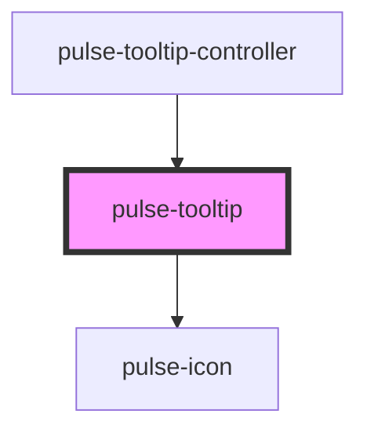

# pulse-tooltip

<!-- Auto Generated Below -->

## Properties

| Property         | Attribute       | Description | Type                                                                                                                                                                                             | Default        |
| ---------------- | --------------- | ----------- | ------------------------------------------------------------------------------------------------------------------------------------------------------------------------------------------------ | -------------- |
| `color`          | `color`         |             | `"bouquet" \| "carbon" \| "carbon-light" \| "copper" \| "error" \| "gold" \| "info" \| "olive" \| "primary" \| "scooter" \| "success" \| "warning" \| "white"`                                   | `'primary'`    |
| `colorgradient`  | `colorgradient` |             | `boolean`                                                                                                                                                                                        | `false`        |
| `colorvariant`   | `colorvariant`  |             | `"100" \| "400" \| "700" \| "900"`                                                                                                                                                               | `'400'`        |
| `description`    | `description`   |             | `string`                                                                                                                                                                                         | `undefined`    |
| `elevation`      | `elevation`     |             | `0 \| 16 \| 2 \| 24 \| 4 \| 8`                                                                                                                                                                   | `8`            |
| `mobileView`     | `mobile-view`   |             | `boolean`                                                                                                                                                                                        | `false`        |
| `objectdest`     | `objectdest`    |             | `string`                                                                                                                                                                                         | `undefined`    |
| `objectdesthtml` | --              |             | `HTMLElement`                                                                                                                                                                                    | `undefined`    |
| `position`       | `position`      |             | `"bottom-end" \| "bottom-middle" \| "bottom-start" \| "left-end" \| "left-middle" \| "left-start" \| "right-end" \| "right-middle" \| "right-start" \| "top-end" \| "top-middle" \| "top-start"` | `'left-start'` |
| `size`           | `size`          |             | `"l" \| "m" \| "s" \| "xl" \| "xs"`                                                                                                                                                              | `'xs'`         |
| `tiptitle`       | `tiptitle`      |             | `string`                                                                                                                                                                                         | `undefined`    |

## Events

| Event           | Description | Type                  |
| --------------- | ----------- | --------------------- |
| `onCloseChange` |             | `CustomEvent<string>` |
| `presentEnd`    |             | `CustomEvent<string>` |

## Methods

### `dismiss() => Promise<void>`

#### Returns

Type: `Promise<void>`

### `recalculate() => Promise<void>`

#### Returns

Type: `Promise<void>`

## Dependencies

### Used by

 - [pulse-tooltip-controller](../tooltip-controller)

### Depends on

- [pulse-icon](../icon)

### Graph

----------------------------------------------

*Team pulse.io! ⭕*
