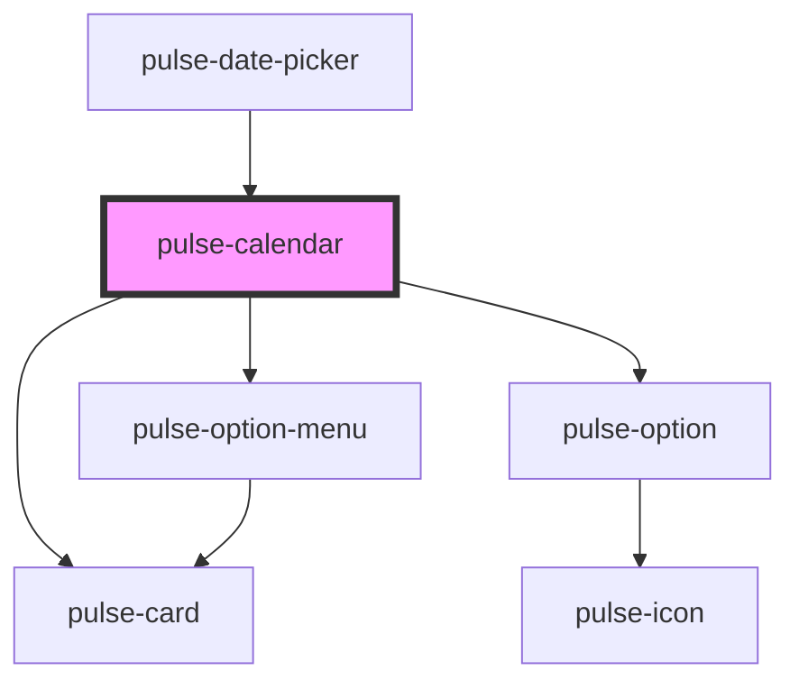

# pulse-calendar

<!-- Auto Generated Below -->

## Properties

| Property  | Attribute | Description | Type                                                                                                                                                           | Default     |
| --------- | --------- | ----------- | -------------------------------------------------------------------------------------------------------------------------------------------------------------- | ----------- |
| `color`   | `color`   |             | `"bouquet" \| "carbon" \| "carbon-light" \| "copper" \| "error" \| "gold" \| "info" \| "olive" \| "primary" \| "scooter" \| "success" \| "warning" \| "white"` | `'primary'` |
| `maxDate` | --        |             | `Date`                                                                                                                                                         | `undefined` |
| `minDate` | --        |             | `Date`                                                                                                                                                         | `undefined` |
| `range`   | `range`   |             | `boolean`                                                                                                                                                      | `false`     |
| `value`   | --        |             | `Date[]`                                                                                                                                                       | `[]`        |

## Events

| Event            | Description | Type                  |
| ---------------- | ----------- | --------------------- |
| `calendarChange` |             | `CustomEvent<Date[]>` |

## Dependencies

### Used by

 - [pulse-date-picker](../date-picker)

### Depends on

- [pulse-option-menu](../../pulse-atm/option-menu)
- [pulse-option](../../pulse-atm/option)
- [pulse-card](../../pulse-atm/card)

### Graph

----------------------------------------------

*Team pulse.io! ⭕*
