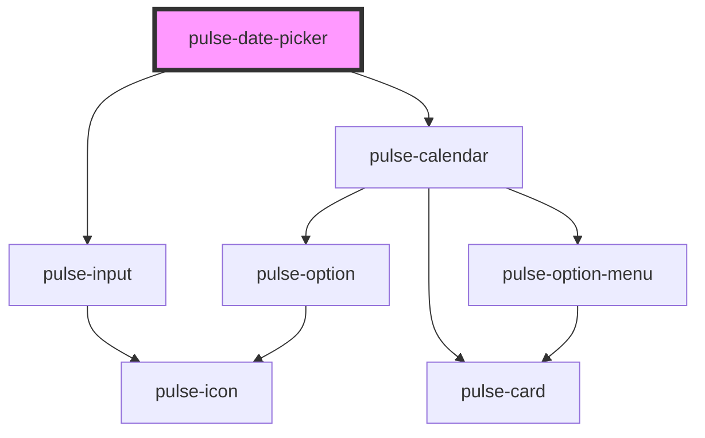

# pulse-date-picker

<!-- Auto Generated Below -->

## Properties

| Property             | Attribute    | Description | Type                                                                                                                                                           | Default     |
| -------------------- | ------------ | ----------- | -------------------------------------------------------------------------------------------------------------------------------------------------------------- | ----------- |
| `color`              | `color`      |             | `"bouquet" \| "carbon" \| "carbon-light" \| "copper" \| "error" \| "gold" \| "info" \| "olive" \| "primary" \| "scooter" \| "success" \| "warning" \| "white"` | `'primary'` |
| `disabled`           | `disabled`   |             | `boolean`                                                                                                                                                      | `false`     |
| `endlabel`           | `endlabel`   |             | `string`                                                                                                                                                       | `''`        |
| `maxDate`            | --           |             | `Date`                                                                                                                                                         | `undefined` |
| `minDate`            | --           |             | `Date`                                                                                                                                                         | `undefined` |
| `range`              | `range`      |             | `boolean`                                                                                                                                                      | `false`     |
| `startlabel`         | `startlabel` |             | `string`                                                                                                                                                       | `''`        |
| `value` _(required)_ | --           |             | `Date[]`                                                                                                                                                       | `undefined` |

## Events

| Event              | Description | Type                  |
| ------------------ | ----------- | --------------------- |
| `datePickerChange` |             | `CustomEvent<Date[]>` |

## Dependencies

### Depends on

- [pulse-input](../../pulse-atm/input)
- [pulse-calendar](../calendar)

### Graph

----------------------------------------------

*Team pulse.io! ⭕*
