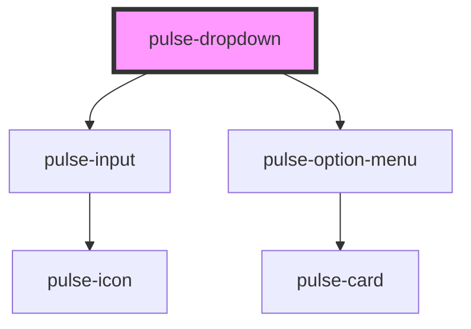

# pulse-drop-down

<!-- Auto Generated Below -->

## Properties

| Property        | Attribute       | Description | Type      | Default         |
| --------------- | --------------- | ----------- | --------- | --------------- |
| `disabled`      | `disabled`      |             | `boolean` | `false`         |
| `ellipsis`      | `ellipsis`      |             | `boolean` | `true`          |
| `insideelement` | `insideelement` |             | `boolean` | `false`         |
| `label`         | `label`         |             | `string`  | `undefined`     |
| `name`          | `name`          |             | `string`  | `this.id`       |
| `placeholder`   | `placeholder`   |             | `string`  | `'Seleccionar'` |
| `text`          | `text`          |             | `string`  | `undefined`     |
| `value`         | `value`         |             | `string`  | `undefined`     |

## Events

| Event         | Description | Type               |
| ------------- | ----------- | ------------------ |
| `pulseChange` |             | `CustomEvent<any>` |

## Dependencies

### Depends on

- [pulse-input](../../pulse-atm/input)
- [pulse-option-menu](../../pulse-atm/option-menu)

### Graph

----------------------------------------------

*Team pulse.io! ⭕*
