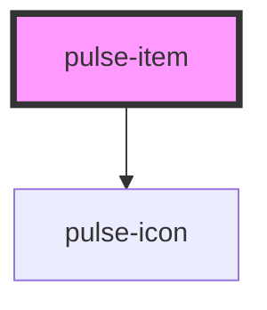

# pulse-item

<!-- Auto Generated Below -->

## Properties

| Property             | Attribute              | Description | Type                 | Default     |
| -------------------- | ---------------------- | ----------- | -------------------- | ----------- |
| `alwaysDescription`  | `always-description`   |             | `boolean`            | `false`     |
| `description`        | `description`          |             | `string \| string[]` | `undefined` |
| `fullContentDesktop` | `full-content-desktop` |             | `boolean`            | `false`     |
| `fullContentMobile`  | `full-content-mobile`  |             | `boolean`            | `false`     |
| `fullContentTablet`  | `full-content-tablet`  |             | `boolean`            | `false`     |
| `hasExpand`          | `has-expand`           |             | `boolean`            | `false`     |
| `lines`              | `lines`                |             | `boolean`            | `true`      |
| `openExpand`         | `open-expand`          |             | `boolean`            | `false`     |

## Events

| Event            | Description | Type               |
| ---------------- | ----------- | ------------------ |
| `expand`         |             | `CustomEvent<any>` |
| `reduceAllItems` |             | `CustomEvent<any>` |
| `reduceExpand`   |             | `CustomEvent<any>` |

## Dependencies

### Depends on

- [pulse-icon](../../pulse-atm/icon)

### Graph

----------------------------------------------

*Team pulse.io! ⭕*
