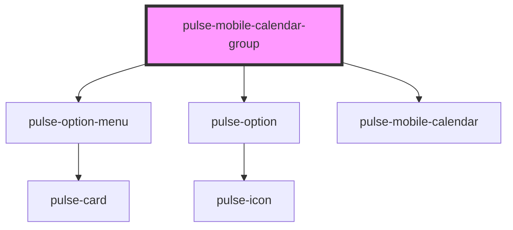

# pulse-mobile-calendar-group

<!-- Auto Generated Below -->

## Properties

| Property            | Attribute           | Description | Type                                                                                                                                                           | Default     |
| ------------------- | ------------------- | ----------- | -------------------------------------------------------------------------------------------------------------------------------------------------------------- | ----------- |
| `color`             | `color`             |             | `"bouquet" \| "carbon" \| "carbon-light" \| "copper" \| "error" \| "gold" \| "info" \| "olive" \| "primary" \| "scooter" \| "success" \| "warning" \| "white"` | `'primary'` |
| `height`            | `height`            |             | `string`                                                                                                                                                       | `'50rem'`   |
| `maxdate`           | --                  |             | `Date`                                                                                                                                                         | `undefined` |
| `mindate`           | --                  |             | `Date`                                                                                                                                                         | `undefined` |
| `monthsrenderrange` | `monthsrenderrange` |             | `number`                                                                                                                                                       | `2`         |
| `range`             | `range`             |             | `boolean`                                                                                                                                                      | `false`     |
| `value`             | --                  |             | `Date[]`                                                                                                                                                       | `[]`        |

## Events

| Event              | Description | Type                  |
| ------------------ | ----------- | --------------------- |
| `confirmSelection` |             | `CustomEvent<Date[]>` |

## Dependencies

### Depends on

- [pulse-option-menu](../../pulse-atm/option-menu)
- [pulse-option](../../pulse-atm/option)
- [pulse-mobile-calendar](../../pulse-atm/mobile-calendar)

### Graph

----------------------------------------------

*Team pulse.io! ⭕*
