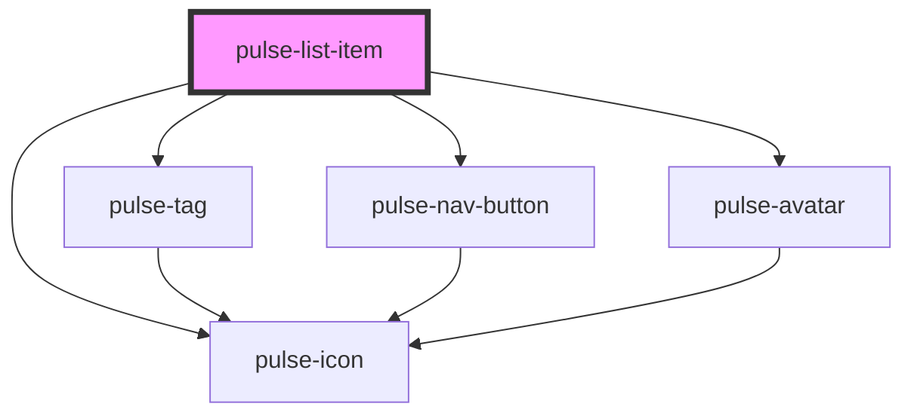

# pulse-list-item

<!-- Auto Generated Below -->

## Properties

| Property                 | Attribute                | Description | Type                                                                                                                                                           | Default         |
| ------------------------ | ------------------------ | ----------- | -------------------------------------------------------------------------------------------------------------------------------------------------------------- | --------------- |
| `additionalsubtitle`     | `additionalsubtitle`     |             | `string`                                                                                                                                                       | `undefined`     |
| `additionalsubtitledesc` | `additionalsubtitledesc` |             | `string`                                                                                                                                                       | `''`            |
| `avataraligncenter`      | `avataraligncenter`      |             | `boolean`                                                                                                                                                      | `false`         |
| `avatarpath`             | `avatarpath`             |             | `string`                                                                                                                                                       | `undefined`     |
| `avatartype`             | `avatartype`             |             | `"icon" \| "img" \| "logo" \| "text"`                                                                                                                          | `'icon'`        |
| `description`            | `description`            |             | `string`                                                                                                                                                       | `''`            |
| `descriptionexpanded`    | `descriptionexpanded`    |             | `string`                                                                                                                                                       | `''`            |
| `fillnavbuttton`         | `fillnavbuttton`         |             | `"clear" \| "solid"`                                                                                                                                           | `'solid'`       |
| `isdisabled`             | `isdisabled`             |             | `boolean`                                                                                                                                                      | `false`         |
| `isexpanded`             | `isexpanded`             |             | `boolean`                                                                                                                                                      | `false`         |
| `isexpandible`           | `isexpandible`           |             | `boolean`                                                                                                                                                      | `true`          |
| `itemid`                 | `itemid`                 |             | `string`                                                                                                                                                       | `undefined`     |
| `itemtitle`              | `itemtitle`              |             | `string`                                                                                                                                                       | `undefined`     |
| `primarynavicon`         | `primarynavicon`         |             | `string`                                                                                                                                                       | `'expand-more'` |
| `primarynaviconcolor`    | `primarynaviconcolor`    |             | `"bouquet" \| "carbon" \| "carbon-light" \| "copper" \| "error" \| "gold" \| "info" \| "olive" \| "primary" \| "scooter" \| "success" \| "warning" \| "white"` | `'primary'`     |
| `secondaryicon`          | `secondaryicon`          |             | `string`                                                                                                                                                       | `''`            |
| `secondaryiconcolor`     | `secondaryiconcolor`     |             | `"bouquet" \| "carbon" \| "carbon-light" \| "copper" \| "error" \| "gold" \| "info" \| "olive" \| "primary" \| "scooter" \| "success" \| "warning" \| "white"` | `'primary'`     |
| `showdivisor`            | `showdivisor`            |             | `boolean`                                                                                                                                                      | `false`         |
| `subtitle`               | `subtitle`               |             | `string`                                                                                                                                                       | `undefined`     |
| `subtitledesc`           | `subtitledesc`           |             | `string`                                                                                                                                                       | `''`            |
| `tagcolor`               | `tagcolor`               |             | `"bouquet" \| "carbon" \| "carbon-light" \| "copper" \| "error" \| "gold" \| "info" \| "olive" \| "primary" \| "scooter" \| "success" \| "warning" \| "white"` | `'primary'`     |
| `tagtext`                | `tagtext`                |             | `string`                                                                                                                                                       | `undefined`     |

## Events

| Event                    | Description | Type                       |
| ------------------------ | ----------- | -------------------------- |
| `itemClicked`            |             | `CustomEvent<boolean>`     |
| `secondaryActionClicked` |             | `CustomEvent<HTMLElement>` |

## Methods

### `collapseItem(collapse: boolean) => Promise<void>`

#### Returns

Type: `Promise<void>`

## Dependencies

### Depends on

- [pulse-tag](../../pulse-atm/tag)
- [pulse-nav-button](../../pulse-atm/nav-button)
- [pulse-icon](../../pulse-atm/icon)
- [pulse-avatar](../../pulse-atm/avatar)

### Graph

----------------------------------------------

*Team pulse.io! ⭕*
