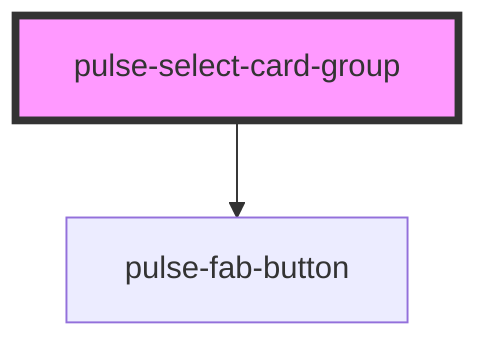

# pulse-select-card-group

<!-- Auto Generated Below -->

## Properties

| Property              | Attribute               | Description | Type                                                             | Default     |
| --------------------- | ----------------------- | ----------- | ---------------------------------------------------------------- | ----------- |
| `allowEmptySelection` | `allow-empty-selection` |             | `boolean`                                                        | `false`     |
| `groupstyle`          | `groupstyle`            |             | `"buttons" \| "composable-column" \| "composable-row" \| "tabs"` | `'buttons'` |
| `position`            | `position`              |             | `any`                                                            | `undefined` |
| `value`               | `value`                 |             | `any`                                                            | `undefined` |

## Events

| Event             | Description | Type               |
| ----------------- | ----------- | ------------------ |
| `cardChange`      |             | `CustomEvent<any>` |
| `pulseScroll`     |             | `CustomEvent<any>` |
| `pulseScrollEnd`  |             | `CustomEvent<any>` |
| `pulseScrollZero` |             | `CustomEvent<any>` |

## Methods

### `isScrollBegin() => Promise<boolean>`

#### Returns

Type: `Promise<boolean>`

### `isScrollable() => Promise<boolean>`

#### Returns

Type: `Promise<boolean>`

### `moveBackwards() => Promise<void>`

#### Returns

Type: `Promise<void>`

### `moveForward() => Promise<void>`

#### Returns

Type: `Promise<void>`

## Dependencies

### Depends on

- [pulse-fab-button](../../pulse-atm/fab-button)

### Graph

----------------------------------------------

*Team pulse.io! ⭕*
