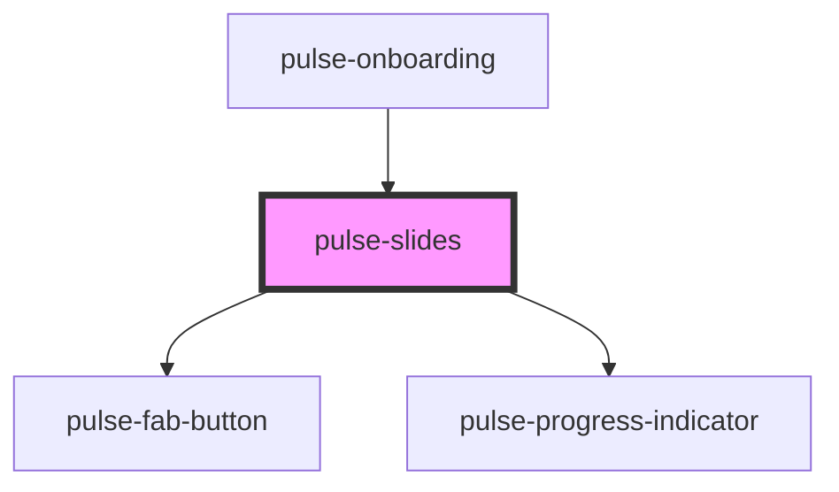

# pulse-slides

<!-- Auto Generated Below -->

## Properties

| Property       | Attribute      | Description                                                                                                                            | Type                                                                                                                                                           | Default     |
| -------------- | -------------- | -------------------------------------------------------------------------------------------------------------------------------------- | -------------------------------------------------------------------------------------------------------------------------------------------------------------- | ----------- |
| `color`        | `color`        | The color to use from your application's color palette to base. For more information on colors, see [theming](https://pulseio.design). | `"bouquet" \| "carbon" \| "carbon-light" \| "copper" \| "error" \| "gold" \| "info" \| "olive" \| "primary" \| "scooter" \| "success" \| "warning" \| "white"` | `'primary'` |
| `colorvariant` | `colorvariant` | The color hue to use from your application's based in colors. For more information on colors, see [theming](https://pulseio.design).   | `"100" \| "400" \| "700" \| "900"`                                                                                                                             | `'700'`     |

## Events

| Event             | Description                                                  | Type                  |
| ----------------- | ------------------------------------------------------------ | --------------------- |
| `changeIndicator` |                                                              | `CustomEvent<any>`    |
| `changeSlide`     | Emmit event to client when change slide. return new position | `CustomEvent<number>` |

## Slots

| Slot                                                                                                                                                                                                                                   | Description |
| -------------------------------------------------------------------------------------------------------------------------------------------------------------------------------------------------------------------------------------- | ----------- |
| `"Put multiples <pulse-slide>. progress indicator depend of them. Back Action -> pulse-fab-button Progress Indicator -> pulse-progress-indicator Foward Action -> pulse-fab-button More info [pulse-slides](https://pulseio.design)."` |             |

## Dependencies

### Used by

 - [pulse-onboarding](../../pulse-templates/onboarding)

### Depends on

- [pulse-fab-button](../../pulse-atm/fab-button)
- [pulse-progress-indicator](../../pulse-atm/progress/indicator)

### Graph

----------------------------------------------

*Team pulse.io! ⭕*
