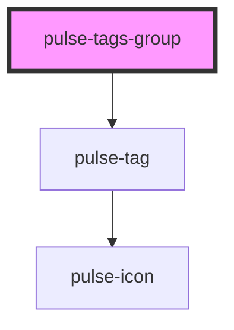

# pulse-tags-group

<!-- Auto Generated Below -->

## Properties

| Property       | Attribute      | Description | Type                                                                                                                                                           | Default     |
| -------------- | -------------- | ----------- | -------------------------------------------------------------------------------------------------------------------------------------------------------------- | ----------- |
| `closeable`    | `closeable`    |             | `boolean`                                                                                                                                                      | `false`     |
| `color`        | `color`        |             | `"bouquet" \| "carbon" \| "carbon-light" \| "copper" \| "error" \| "gold" \| "info" \| "olive" \| "primary" \| "scooter" \| "success" \| "warning" \| "white"` | `'primary'` |
| `colorvariant` | `colorvariant` |             | `"100" \| "400" \| "700" \| "900"`                                                                                                                             | `'400'`     |
| `fill`         | `fill`         |             | `"clear" \| "outline" \| "solid"`                                                                                                                              | `'outline'` |
| `size`         | `size`         |             | `"l" \| "m" \| "s" \| "xl" \| "xs"`                                                                                                                            | `'s'`       |
| `tagdata`      | --             |             | `TagData[]`                                                                                                                                                    | `[]`        |
| `text`         | `text`         |             | `string`                                                                                                                                                       | `undefined` |

## Events

| Event      | Description | Type               |
| ---------- | ----------- | ------------------ |
| `closeTag` |             | `CustomEvent<any>` |

## Dependencies

### Depends on

- [pulse-tag](../../pulse-atm/tag)

### Graph

----------------------------------------------

*Team pulse.io! ⭕*
