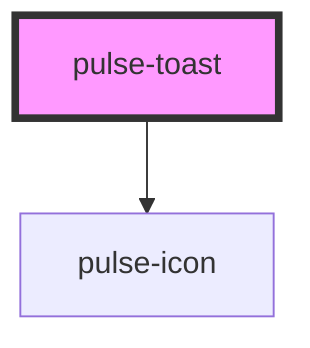

# pulse-modal

<!-- Auto Generated Below -->

## Properties

| Property       | Attribute      | Description | Type                                                                                                                                                           | Default     |
| -------------- | -------------- | ----------- | -------------------------------------------------------------------------------------------------------------------------------------------------------------- | ----------- |
| `closeable`    | `closeable`    |             | `boolean`                                                                                                                                                      | `true`      |
| `color`        | `color`        |             | `"bouquet" \| "carbon" \| "carbon-light" \| "copper" \| "error" \| "gold" \| "info" \| "olive" \| "primary" \| "scooter" \| "success" \| "warning" \| "white"` | `'success'` |
| `colorvariant` | `colorvariant` |             | `"100" \| "400" \| "700" \| "900"`                                                                                                                             | `'100'`     |
| `elevation`    | `elevation`    |             | `0 \| 16 \| 2 \| 24 \| 4 \| 8`                                                                                                                                 | `8`         |
| `image`        | `image`        |             | `string`                                                                                                                                                       | `undefined` |
| `text`         | `text`         |             | `string`                                                                                                                                                       | `undefined` |
| `time`         | `time`         |             | `number`                                                                                                                                                       | `10000`     |

## Events

| Event         | Description | Type               |
| ------------- | ----------- | ------------------ |
| `toastClosed` |             | `CustomEvent<any>` |

## Dependencies

### Depends on

- [pulse-icon](../../pulse-atm/icon)

### Graph

----------------------------------------------

*Team pulse.io! ⭕*
