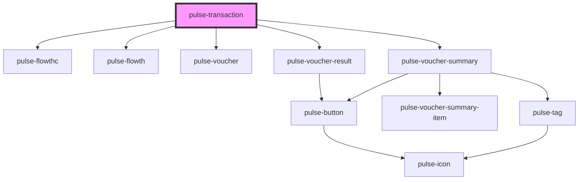

# pulse-transaction

<!-- Auto Generated Below -->

## Properties

| Property                   | Attribute | Description | Type           | Default     |
| -------------------------- | --------- | ----------- | -------------- | ----------- |
| `voucherdata` _(required)_ | --        |             | `VoucherModel` | `undefined` |

## Events

| Event                    | Description | Type               |
| ------------------------ | ----------- | ------------------ |
| `mailactionclicked`      |             | `CustomEvent<any>` |
| `mainactionclicked`      |             | `CustomEvent<any>` |
| `secondaryactionclicked` |             | `CustomEvent<any>` |

## Dependencies

### Depends on

- [pulse-flowthc](../../pulse-templates/flowthc)
- [pulse-flowth](../../pulse-templates/flowth)
- [pulse-voucher](../../pulse-templates/voucher)
- [pulse-voucher-result](../../pulse-patterns/voucher-result)
- [pulse-voucher-summary](../../pulse-patterns/voucher-summary)

### Graph

----------------------------------------------

*Team pulse.io! ⭕*
