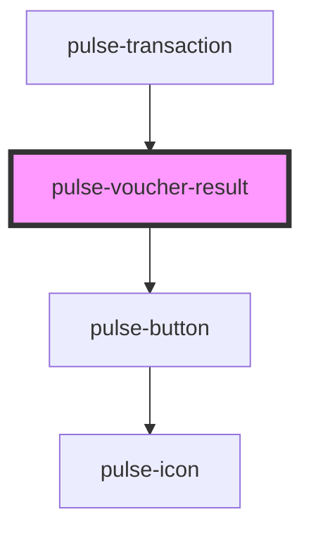

# pulse-voucher-result

<!-- Auto Generated Below -->

## Properties

| Property                       | Attribute | Description | Type                                | Default     |
| ------------------------------ | --------- | ----------- | ----------------------------------- | ----------- |
| `state`                        | `state`   |             | `"error" \| "pending" \| "success"` | `'success'` |
| `voucherControls` _(required)_ | --        |             | `VoucherControls`                   | `undefined` |
| `voucherHeader` _(required)_   | --        |             | `VoucherHeader`                     | `undefined` |

## Events

| Event              | Description | Type               |
| ------------------ | ----------- | ------------------ |
| `mailclicked`      |             | `CustomEvent<any>` |
| `mainclicked`      |             | `CustomEvent<any>` |
| `secondaryclicked` |             | `CustomEvent<any>` |

## Dependencies

### Used by

 - [pulse-transaction](../../pulse-pages/transaction)

### Depends on

- [pulse-button](../../pulse-atm/button)

### Graph

----------------------------------------------

*Team pulse.io! ⭕*
