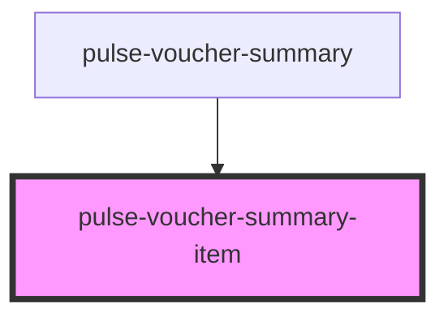

# pulse-voucher-summary-item

<!-- Auto Generated Below -->

## Properties

| Property                 | Attribute    | Description | Type                                | Default     |
| ------------------------ | ------------ | ----------- | ----------------------------------- | ----------- |
| `hideborder`             | `hideborder` |             | `boolean`                           | `false`     |
| `state`                  | `state`      |             | `"error" \| "pending" \| "success"` | `'success'` |
| `titlename` _(required)_ | `titlename`  |             | `string`                            | `undefined` |

## Dependencies

### Used by

 - [pulse-voucher-summary](../voucher-summary)

### Graph

----------------------------------------------

*Team pulse.io! ⭕*
