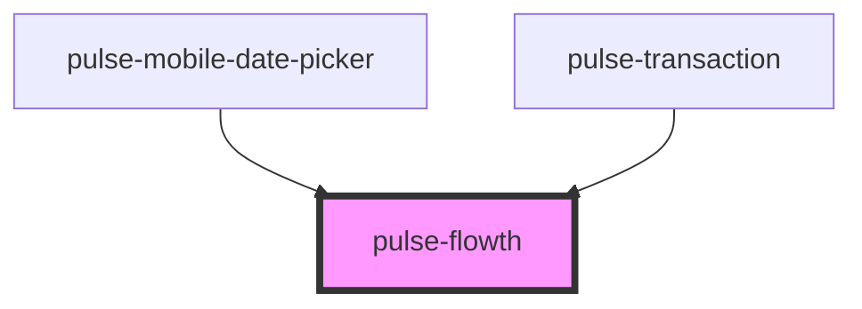

# pulse-flowth

<!-- Auto Generated Below -->

## Properties

| Property    | Attribute    | Description | Type                           | Default |
| ----------- | ------------ | ----------- | ------------------------------ | ------- |
| `elevation` | `elevation`  |             | `0 \| 16 \| 2 \| 24 \| 4 \| 8` | `8`     |
| `showLeft`  | `show-left`  |             | `boolean`                      | `true`  |
| `showRight` | `show-right` |             | `boolean`                      | `true`  |

## Dependencies

### Used by

 - [pulse-mobile-date-picker](../../pulse-mol/mobile-date-picker)
 - [pulse-transaction](../../pulse-pages/transaction)

### Graph

----------------------------------------------

*Team pulse.io! ⭕*
