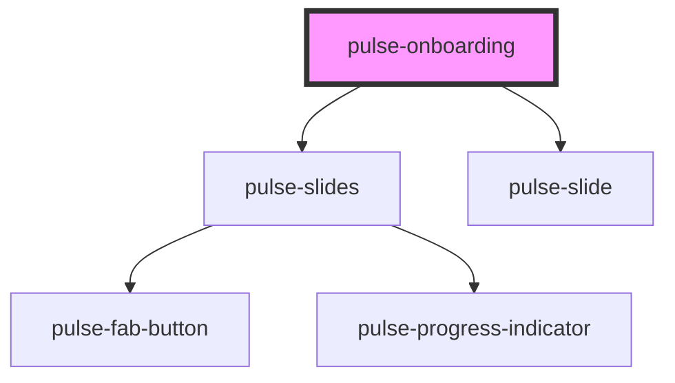

# pulse-onboarding

<!-- Auto Generated Below -->

## Properties

| Property | Attribute | Description | Type                    | Default     |
| -------- | --------- | ----------- | ----------------------- | ----------- |
| `data`   | --        |             | `PulseOnBoardingItem[]` | `undefined` |

## Events

| Event             | Description                                                                               | Type                   |
| ----------------- | ----------------------------------------------------------------------------------------- | ---------------------- |
| `showButtonEvent` | The state of the last slide. For more information, see [theming](https://pulseio.design). | `CustomEvent<boolean>` |

## Dependencies

### Depends on

- [pulse-slides](../../pulse-mol/slides)
- [pulse-slide](../../pulse-mol/slide)

### Graph

----------------------------------------------

*Team pulse.io! ⭕*
